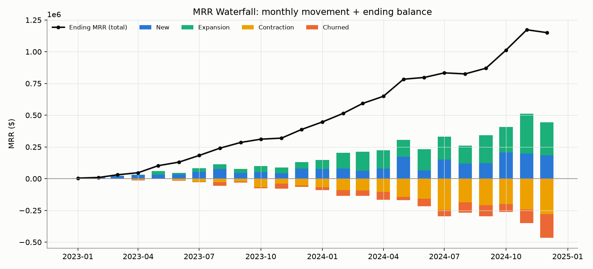
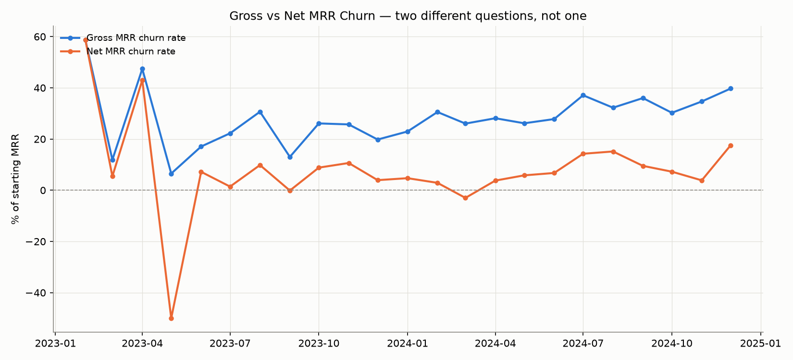
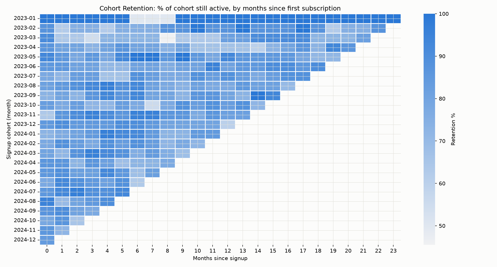
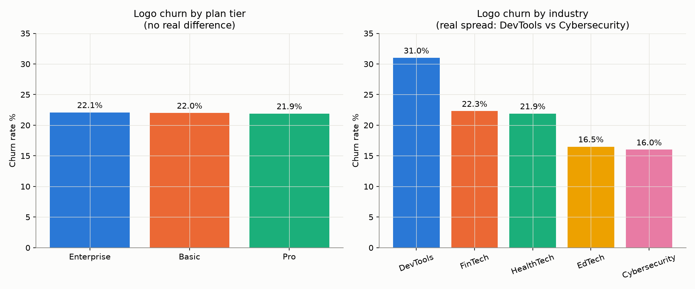

# SaaS Revenue & Churn Health Dashboard

**Status:** 🚧 In progress — Stage 1 (environment setup)

## Business context

I'm supporting a VP of Customer Success at a mid-size SaaS company. The
question on the table: **is this business actually growing in a healthy
way, or is churn quietly eating our gains — and which customer segments
need intervention right now?**

That splits into three parts, each answered with its own layer of this
project:

1. **Are we growing?** — monthly MRR trend (new / expansion / contraction / churned)
2. **Are we leaking?** — gross MRR churn, net MRR churn, and net revenue
   retention (NRR), calculated as three distinct metrics, not conflated
3. **Where's the risk concentrated?** — cohort retention and segment-level
   breakdowns, with a hypothesis test on churn differences between segments

This is an analyst project: the rigor comes from correct SQL, correctly
defined financial metrics, and light statistical testing — not from
machine learning. There is no predictive model here.

## Dataset

[RavenStack SaaS Subscription & Churn Analytics Dataset](https://www.kaggle.com/datasets/rivalytics/saas-subscription-and-churn-analytics-dataset)
by **River @ Rivalytics** (Kaggle, MIT-like license, fully synthetic —
credit to the original author as required by the license). Five
relational tables: `accounts`, `subscriptions` (with MRR/ARR and
upgrade/downgrade flags), `feature_usage` (time-series engagement),
`support_tickets`, and `churn_events`.

**Data profile:**
- accounts: 500 · subscriptions: 5,000 · feature_usage: 25,000 ·
  support_tickets: 2,000 · churn_events: 600
- Calendar coverage: **Jan 2023 – Dec 2024** (2 full years) across every
  table — enough for a real MRR trend and up to 24 months of cohort
  tracking on the earliest signups
- Churn is tracked at **three levels** that won't always agree:
  `accounts.churn_flag`, `subscriptions.churn_flag`, and a separate
  `churn_events` table (an account can have one churned subscription
  while remaining active overall, etc.) — reconciling these correctly is
  part of the SQL work in Stage 3, not a data quality issue to ignore

## Tech stack (all free)

- **PostgreSQL** (Docker) — the SQL layer where all metrics are built
- **Python** (pandas, scipy) — EDA and light statistical testing on top of
  the SQL outputs
- **Tableau Public** — the dashboard
- **Ollama** (local LLM, runs on-device) — generates a plain-English
  executive summary of the latest metrics, no API costs
- **Streamlit Community Cloud** — hosts a page presenting the AI summary
  alongside the dashboard. Ollama can't run on Streamlit's free hosting,
  so the summary is *pre-generated locally* on each data refresh and
  read from a saved file by the deployed app — a common, legitimate
  pattern for keeping a local-LLM step out of a hosting environment that
  can't run one, and it's called out plainly rather than presented as
  live inference.
- **Docker** — reproducible environment for Postgres (and later, the app)

## Repo structure

```
data/raw/          original Kaggle CSVs (not committed — see below)
data/processed/    SQL query outputs used by the Python/Tableau layers
sql/schema/        table DDL
sql/views/         reusable building-block views (clean subscription
                    timeline, calendar spine, account-month MRR grid)
sql/metrics/       MRR waterfall, gross/net churn + NRR, cohorts, segments
python/eda/        EDA + light statistics
python/ai_summary/ local Ollama summary generation script
dashboard/         Tableau workbook + screenshots
streamlit_app/     the Streamlit page
docker/            docker-compose.yml, Postgres init
outputs/           charts and generated AI summaries
```

Raw and processed data aren't committed to the repo (see `.gitignore`) —
the dataset is free and one command away via the Kaggle API; instructions
below.

## Getting the data

```bash
# one-time: put your Kaggle API token at ~/.kaggle/access_token (see
# kaggle.com/settings -> API -> Create New Token), then:
.venv/bin/kaggle datasets download -d rivalytics/saas-subscription-and-churn-analytics-dataset -p data/raw --unzip
```

## Running the database

```bash
cp .env.example .env        # fill in your own local credentials
docker compose -f docker/docker-compose.yml --env-file .env up -d

set -a; source .env; set +a
export PGPASSWORD="$POSTGRES_PASSWORD"
psql -h localhost -p "$POSTGRES_PORT" -U "$POSTGRES_USER" -d "$POSTGRES_DB" -f sql/schema/001_create_tables.sql
psql -h localhost -p "$POSTGRES_PORT" -U "$POSTGRES_USER" -d "$POSTGRES_DB" -f sql/schema/002_load_data.sql
```

### Data quality notes (found and handled during load)

- `feature_usage.usage_id` is **not actually unique** in the source CSV
  (21 of 25,000 rows reuse an ID across unrelated events). We use a
  surrogate `BIGSERIAL` primary key instead and keep `usage_id` as a
  plain reference column — flagged rather than silently forced through.
- `support_tickets.satisfaction_score` is stored as a decimal-formatted
  string (`"4.0"`) for what's really a 1–5 whole-number rating —
  `NUMERIC(2,1)` instead of `SMALLINT` to accept it as-is.

## Charts






## AI-generated executive summary (example, Dec 2024 data)

*Generated locally by `llama3.2:3b` via Ollama — see the section below for
what this pattern is and how it was validated for factual accuracy.*

> Our latest month's MRR ended at $1,150,514, showing a month-over-month
> decline of $22,470 from the prior month's ending MRR. This represents
> a growth rate of -1.92% from the previous month. Notably, the
> expansion revenue from existing customers has offset some of the
> contraction revenue, leading to a net MRR churn rate of 17.58%, which
> is lower than the gross churn rate of 39.72%.
>
> The distinction between the two churn rates is attributed to the
> expansion revenue offsetting some of the losses. Expansion revenue
> from existing customers is the primary driver of this difference,
> rather than any other factor.
>
> In terms of churn patterns, the analysis reveals that plan tier does
> not meaningfully predict churn. The chi-square test result indicates
> that the tiers are essentially tied, with the Enterprise tier at
> 22.1%, Basic at 22.0%, and Pro at 21.9% — the difference between the
> tiers is not statistically significant.
>
> Segmenting the data by industry reveals a real trend: DevTools
> exhibits the highest churn rate at 31.0%, while Cybersecurity has the
> lowest at 16.0%.
>
> **Recommendation:** Customer Success should focus on proactively
> engaging with DevTools customers to understand the root causes of
> their churn and develop targeted retention strategies.

## Running the Streamlit app locally

```bash
# venv (fast, for iterating on the app)
.venv/bin/streamlit run streamlit_app/app.py

# OR Docker (build context must be the repo ROOT, not streamlit_app/,
# since it needs requirements.txt and outputs/ from there)
docker build -f streamlit_app/Dockerfile -t saas-churn-streamlit .
docker run -p 8501:8501 saas-churn-streamlit
```
Free deployment (what's actually used in production): push to GitHub,
connect the repo at share.streamlit.io (free tier), set the main file
to `streamlit_app/app.py`. That deployment does NOT use the Dockerfile
above — Streamlit Community Cloud builds directly from
`requirements.txt`. The Dockerfile is for local reproducibility only,
consistent with this project's Docker-for-the-environment approach.

## Local AI summary layer (Ollama)

`python/ai_summary/generate_summary.py` uses **Ollama** running
`llama3.2:3b` locally (free, no API key, ~2GB model, runs comfortably on
an M-series Mac) to turn `outputs/summaries/metrics_snapshot.json` into
a plain-English executive summary, saved to
`outputs/summaries/executive_summary.json`.

**Why local, and why pre-generated rather than live:** Streamlit
Community Cloud's free tier can't run Ollama (no GPU/local model
hosting). So this script is meant to be run locally each time the data
refreshes — its only output is a small JSON file that gets committed
alongside the data, and the deployed Streamlit app just reads that file.
This is a legitimate, common real-world pattern for keeping a
local-inference step out of a hosting environment that can't run one —
the README is upfront about it rather than presenting it as live
per-visitor inference.

**A real limitation worth documenting, not hiding:** getting factually
reliable output from a 3B model took real iteration, not a one-shot
prompt. First draft invented a cause for the gross/net churn gap
("billing issues" — not in the data) and mislabeled the lowest-churn
industry as a churn problem. Second draft fixed the industry mix-up but
fabricated a dollar figure ($57,121) that didn't match either number it
had been given. The fix that actually worked: stop asking the model to
compare or calculate anything — precompute every ranking and every
derived number (highest/lowest industry, highest/lowest plan tier, the
exact dollar MRR delta) in Python and hand them over as stated facts,
leaving the model's job purely prose, not arithmetic or comparison. This
is a real constraint of small local models worth knowing before relying
on one for anything numeric.

## Progress log

- **Stage 0** — Evaluated 3 candidate Kaggle datasets, chose RavenStack
  for having real MRR amounts, upgrade/downgrade flags (needed for a
  correct expansion/contraction waterfall), true calendar dates, and a
  time-series engagement table.
- **Stage 1** — Repo scaffolded, git initialized, Python 3.12 virtual
  environment created (Homebrew Python, not the older Apple-system
  3.9.6), Docker Desktop confirmed running natively on Apple Silicon
  (`linux/aarch64`, no emulation). Dataset pulled via Kaggle API,
  MIT-like license confirmed, row counts and date range validated
  against the source.
- **Stage 2** — Postgres 16 (arm64-native, no emulation) running in
  Docker via `docker-compose.yml`. Schema created across 5 tables with
  PK/FK constraints and indexes on join/filter columns. All 5 CSVs
  loaded via `\copy`; row counts and referential integrity (zero
  orphaned foreign keys) verified against source.
- **Stage 3 (in progress)** — MRR waterfall built and verified. Found
  that raw `subscription.end_date` is unreliable (353 of 441 chained
  subscription pairs per account overlapped in the raw data — a source
  data-quality gap, not a real business scenario of concurrent plans),
  so built `subscription_timeline` (a view) to derive a trustworthy
  effective end date from each account's own event sequence instead.
  Built on that: a `calendar_months` spine, an `account_month_mrr` grid,
  and the final waterfall — verified with zero arithmetic mismatches
  and zero month-to-month continuity breaks across all 24 months.
  Gross MRR churn, net MRR churn, and NRR built on top of the same
  classification view — verified the identity NRR% + Net Churn% = 100%
  holds with zero mismatches across every month. The earlier flagged
  question ($0-MRR trial subscriptions) turned out not to need a special
  rule: these are *revenue*-denominated metrics, so a $0-revenue period
  is correctly treated as no revenue regardless of trial status — that
  would only matter for a logo/customer-count churn metric, which isn't
  in scope here. Cohort retention and segment breakdowns are also done.
  Cohort anchor had to be corrected: `accounts.signup_date` turned out
  to mean "account created," not "started paying" — 95% of accounts
  have a real gap (avg 33 days) before their first subscription, which
  produced an inverted retention curve when anchored on signup_date.
  Re-anchored cohorts on each account's first subscription start_date
  instead, which is the standard, defensible basis and produces a
  sane curve (starts ~100%, blended retention flat around 80-85%
  through month 12). Segment breakdown: logo churn rate by original
  signup plan_tier (all 3 tiers within ~1pt of each other — plan tier
  alone doesn't explain who churns) and monthly MRR by current plan
  tier for Tableau's segment/date filters.
- **Stage 4** — Python EDA + light stats (`python/eda/eda_and_stats.py`).
  Deliberately thin: it runs the already-verified `.sql` files directly
  (one source of truth for metric logic, no reimplementation in
  pandas), exports 6 CSVs to `data/processed/` for Tableau, makes 4
  charts, and runs 2 hypothesis tests. Chart colors picked and verified
  colorblind-safe via the project's data-viz color validator (fixed
  categorical slot order, single-hue sequential ramp for the heatmap —
  not a rainbow colormap). Also writes
  `outputs/summaries/metrics_snapshot.json`, the structured input the
  Stage 6 Ollama summary will read.
- **Stage 6** — Ollama installed (Homebrew, arm64-native), `llama3.2:3b`
  pulled (~2GB). Summary generation script built and iterated until
  factually reliable (see "Local AI summary layer" section above for
  what went wrong and the fix). Verified the final generated summary
  against the source numbers by hand — all figures and comparisons
  check out.
- **Stage 7** — Streamlit page (`streamlit_app/app.py`): KPI tiles,
  the AI executive summary with an explicit "generated locally, not
  live" timestamp banner, a Tableau embed slot (`streamlit_app/config.py`
  — set once the workbook is published to Tableau Public), and the 4
  supplementary charts. Smoke-tested locally (HTTP 200, no errors).
  Deploy: push to GitHub, connect the repo on
  share.streamlit.io (free tier), set main file to
  `streamlit_app/app.py`.
- **Stage 8** — `streamlit_app/Dockerfile` added for local
  reproducibility (`python:3.12-slim`, official multi-arch image, pulls
  natively on Apple Silicon). Built and ran it: confirmed `linux/arm64`
  (no emulation) and HTTP 200 serving correctly. Actual free deployment
  uses share.streamlit.io directly from `requirements.txt`, not this
  Dockerfile — Postgres (Stage 2) remains the only service that needs
  Docker in production use of this project.

## Key findings

*(more to be added as the remaining metrics are built)*

- MRR grew from $4.5K (Jan 2023) to a peak of $1.17M (Nov 2024) — steady
  month-over-month growth for nearly the entire window.
- **December 2024 is the first month MRR actually declines** ($1.173M →
  $1.151M), driven by the single largest churned-MRR figure in the whole
  dataset (-$185,954) — new + expansion revenue ($443K) wasn't enough to
  offset contraction + churn (-$466K) that month. Worth investigating
  which segment(s) drove this once the segment breakdowns are built.
- **Gross MRR churn averages 28.3%/month, but net MRR churn averages
  only 8.2%/month (avg NRR: 91.8%)** — expansion revenue is consistently
  offsetting roughly 70% of gross losses. 3 of 23 measurable months even
  had *negative* net churn (NRR > 100%). Read this gap carefully: gross
  churn this high is not a typical SaaS benchmark — it reflects this
  being a synthetic pre-launch/pilot-stage dataset (per the source
  README) with unusually high subscription turnover, not a real
  industry rate. The **relationship** between gross and net churn (net
  consistently well below gross) is the meaningful, transferable
  finding — the absolute magnitude is a dataset characteristic.
- **Logo churn rate is nearly identical across plan tiers**: Enterprise
  22.1%, Basic 22.0%, Pro 21.9%. Confirmed statistically, not just
  eyeballed — a chi-square test of independence (plan tier x
  churned/not) returns p = 0.999. Plan tier does not predict churn in
  this data.
- **Industry does predict churn.** DevTools churns at 31.0% vs
  Cybersecurity at 16.0% — nearly double. A two-proportion z-test
  confirms this is a real difference, not noise (z = 2.56, p = 0.011,
  significant at the 0.05 level). **This is the actionable segment
  finding**: if Customer Success has to prioritize outreach, industry
  vertical is a far better signal than plan tier.
- **Cohort retention holds fairly flat around 80-85% through month 12**
  once correctly anchored on first-subscription date (see methodology
  note above) — no steep early-tenure cliff, attrition is more evenly
  spread across tenure than a typical SaaS onboarding-drop-off pattern.

## Business recommendation

*(filled in at the end, once findings are in)*
